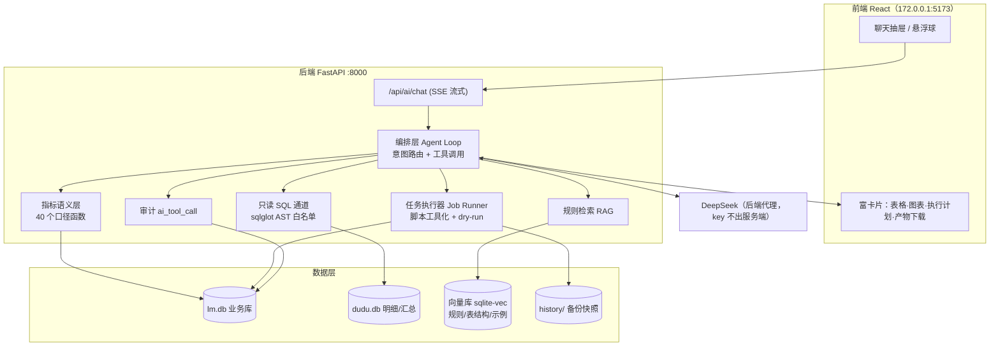

# LM订单管理系统 · AI 聊天集成设计方案

> 版本 v1.0 · 2026-09-12 · 护卫
> 目标：在系统界面里用「问答」的方式查所有数据、并驱动「分数据」「提单」两类日常工作。

---

## 1. 目标与场景

| 场景 | 用户一句话 | 系统应做的事 |
|---|---|---|
| 数据问答 | 「昨天营业额多少？哪个代理赚最多？」 | 查库/查汇总表 → 表格/图表 + 口径说明 |
| 明细追查 | 「13812345678 这条是谁的、哪来的？」 | 跨库检索手机号全历史（上游/代理/任务/渠道/省市/姓名） |
| 规则咨询 | 「660007 交付有什么限制？」 | 规则库 RAG 回答（附出处段落） |
| 分数据 | 「把今天的新-88339 分一下，660007 剔京津」 | 生成执行计划 → 确认 → 跑流水线 → 回传产物与数量 |
| 提单 | 「按今天总表出牛表+新甲方 6 张分表」 | 生成执行计划 → 确认 → 转化 → 回传成品 |
| 收工 | 「收工」 | 备份/入库/清源/停单提醒清理 → 汇总报告 |

**非目标（本期不做）**：AI 直接改生产库、AI 自行决定付款/结算、AI 代替人工对外发消息。

---

## 2. 现状盘点（2026-09-12 实测）

| 组件 | 事实 |
|---|---|
| 前端 | React + Vite（`~/dudu-system/frontend`），dev `[::1]:5173`，`/api` 代理到 `127.0.0.1:8000`；页面 Orders/Customers/Dashboard/Categories/Login |
| 后端 | FastAPI `app.main:app`，uvicorn `*:8000`，JWT Bearer 鉴权，`sys_user/sys_role/sys_permission` 权限体系；`operation_log` 已有 |
| 库 1 | `backend/data/lm.db`（SQLite，118KB）：customer / orders / order_url / daily_data / bill / alert / url / channel / fund … **业务主库，目前数据量小（7 客户、2 订单）** |
| 库 2 | `~/dudu-system/data/dudu.db`（**5.3GB**，Flask `app.py` :5000）：上游客 / 日活明细 / v2 汇总（fact_*/dim_*），196 万行明细 |
| 数据脚本 | `~/.openclaw/workspace/scripts/`：daily_pipeline.py、dedup_lib_update.py、split_wash.py、bill.py、shougong.sh、stop_reminder_cleanup.py、archive_ingest.py |
| 规则资产 | `桌面/每日作业流程.md`、`~/.openclaw/workspace/提单表转化记忆.md`、MEMORY.md 业务规则 |
| 模型 | 已有 DeepSeek API Key（openai-compatible，`https://api.deepseek.com`），V4-Flash 便宜 / V4-Pro 更准 |

> 结论：**系统处于早期（数据量很小）**，正是把 AI 助手做进架构里的最佳时机；数据量大的那部分是 dudu.db，通过汇总表暴露即可。

---

## 3. 总体架构



**核心原则**
1. **数字永远由后端算，模型只负责"翻译意图"** —— 杜绝幻觉金额。
2. **写操作 100% 人工确认**（执行计划卡 → 点确认 → 才跑）。
3. **一切可溯源**：每个回答附「口径 + 数据来源 + 查询时间」；每次工具调用留审计。
4. **不引入重型框架**：Python + openai SDK + FastAPI 内嵌，~800 行可控代码。

---

## 4. 三类能力的实现路径

### 4.1 数据问答（读）
**三层降级，按优先级：**

| 层 | 机制 | 优点 | 触发条件 |
|---|---|---|---|
| ① **指标语义层**（主） | 预定义口径函数，LLM 只输出 JSON：`{metric, dims, filters, date_range, compare}` | 口径唯一、结果稳定、不可能写错 SQL | 命中指标目录 |
| ② **只读 SQL**（兜底） | sqlglot 解析 → 仅 SELECT、表白名单、禁 ATTACH/PRAGMA/写操作；`mode=ro` 只读连接；LIMIT 500；5s 超时 | 覆盖长尾问题 | 指标层未命中 |
| ③ **规则 RAG** | 规则文档切块向量化，回答附出处 | 解决"规则是什么"类问题 | 语义检索命中 |

**指标语义层目录（首批 20~30 个）**
- 经营：`今日营业额/进货/利润/洗名费`、`某代理某日销售额/成本/利润`、`日趋势`、`代理排行`
- 渠道：`某日某渠道数量（106/小程序/DPI 白灰 移动电信联通）`
- 客户：`余额/欠款`、`充值记录`、`单价表`、`让利`
- 订单：`在执任务`、`今日提单`、`停单提醒`、`T+2 出货对账`
- 明细：`手机号全历史`（跨 lm.db + dudu.db）、`任务名→代理→渠道`

> 好处：口径写死在函数里（如 660003 九折、660007 单价 +2 分、T+2 出货），模型改不了，天然防错。

### 4.2 分数据（写 · 工作流）
把现有脚本**包装成工具**，每个工具声明：参数 schema、风险等级、是否支持 dry-run、产物路径。

```
工具：split_new_data
  入参：{file: "新-88339.xlsx", date: "0912", options: {exclude_jingjin: true}}
  流程：匹配回执 → 分代理 → 分渠道 → 去重 → 加工 → 洗名 → 记账 → 校验
  输出：{各代理数量, 渠道分布, 产物目录, 异常清单}
```

**强制人工确认（HITL）流程：**

```
用户：「把今天的新-88339分一下，660007剔京津」
  ↓ LLM 生成执行计划（不执行）
┌──────────────── 执行计划 ────────────────┐
│ 工具：split_new_data  日期：09-12        │
│ 输入：每日数据/新-88339.xlsx（33,553 行） │
│ 选项：660007 剔京津 ✓（规则默认）         │
│ 预计影响：11 个代理 / 8 类渠道            │
│ ⚠ 将写入：桌面/每日数据/新0912-分代理/     │
│ [取消]  [仅试运行]  [确认执行]            │
└──────────────────────────────────────────┘
  ↓ 点【确认执行】
Job Runner 后台执行 → 实时日志 → 产物下载卡片
```

**安全护栏**
- 执行前自动快照（复用 `shougong.sh` 的 history 备份机制），可回滚
- 参数服务端二次校验（不信任模型输出；文件路径白名单）
- 高风险工具（提单表、账单写入）需 `ai.action.highrisk` 权限 + 二次确认

### 4.3 提单（写 · 工作流）
- 工具：`gen_tidaobiao`（总表 → 牛表 14 列 + 甲方新 6 张分表）、`stop_reminder_check`（到期必停扫描）、`gen_huizhi`（回执版式）
- 规则固化：列结构、斑马纹、**LM** 名称列、工单号日期段=当天 MMdd、停单区必含到期条目…全部写成模板函数，模型只传日期与源文件
- 产出校验：转化后自动跑「列数/表头/停单区完整性」自检，异常直接报错而不是交付

---

## 5. 数据模型新增（lm.db）

```sql
ai_session(id, user_id, title, created_at, updated_at, archived)
ai_message(id, session_id, role, content, tool_calls_json, tokens, model, created_at)
ai_tool_call(id, session_id, message_id, tool, args_json, risk, dry_run,
             status, result_json, error, user_id, confirmed_at, created_at)
ai_job(id, tool, args_json, status, progress, log_path, outputs_json,
       started_at, finished_at, operator_id)
ai_feedback(id, message_id, rating, comment, created_at)
```

权限点（挂到 `sys_permission`）：
`ai.chat`（基础问答）、`ai.query.sql`（SQL 兜底）、`ai.action`（写工作流）、`ai.action.highrisk`（提单/账单）、`ai.view.pii`（看完整手机号/身份证）。

---

## 6. API 草案

| 方法 | 路径 | 说明 |
|---|---|---|
| POST | `/api/ai/chat` | SSE 流式；body `{session_id, message}`；事件：`token / plan / tool_call / done` |
| GET | `/api/ai/sessions` | 会话列表 |
| GET | `/api/ai/sessions/{id}/messages` | 历史 |
| DELETE | `/api/ai/sessions/{id}` | 删除会话 |
| POST | `/api/ai/jobs/{id}/confirm` | 确认执行（HITL 关键闸门） |
| POST | `/api/ai/jobs/{id}/cancel` | 取消 |
| GET | `/api/ai/jobs/{id}` | 进度 + 日志尾部 + 产物 |
| GET | `/api/ai/tools` | 工具元数据（前端渲染计划卡） |
| POST | `/api/ai/feedback` | 👍/👎 进评测集 |

---

## 7. 前端交互

- **入口**：右下角悬浮球「小护卫 🛡️」→ 右侧抽屉（不打断现有页面，可拖动变宽）
- **消息类型**：正文 Markdown / **表格卡** / **图表卡**（复用 `static/echarts.min.js`）/ **执行计划卡**（确认按钮）/ **任务进度卡**（实时日志）/ **产物卡**（下载）
- **快捷指令 chips**：今日经营？｜查手机号｜代理排行｜分数据｜出提单表｜收工
- **溯源**：每条数据回答底部一行小字：`口径：P1 营业额=Σ代理×九折−让利 ｜ 来源：fact_bill 2026-09-11 ｜ 12:03 查询`
- **会话**：左侧历史列表，标题自动摘要，文件可拖入对话框（如拖 xlsx 直接说「分这个」）

---

## 8. 安全与合规

| 风险 | 对策 |
|---|---|
| 模型乱写 SQL | 只读连接 + AST 白名单 + 表/视图白名单 + LIMIT + 超时 |
| 模型误删/误改 | 生产库无写权限；写操作只能走白名单脚本 + 人工确认 + 执行前快照 |
| 提示注入（上游文件/客户名里藏指令） | 外部内容标记为**不可信**，不参与工具决策；工具参数服务端强校验 |
| 数据泄露 | 手机号/身份证默认脱敏（`138****5678`），`ai.view.pii` 权限才看全；key 只存后端 |
| 成本失控 | 每用户日 token 上限 + 结果缓存 + 简单问题走 Flash 模型 |
| 无法追责 | `ai_tool_call` + `operation_log` 全量审计（谁/何时/参数/结果/产物） |
| 公网暴露 | 复用 Cloudflare Access 或 Tailscale，别裸奔（详见 09-12 隧道方案） |

---

## 9. 技术选型（含开源预研）

| 环节 | 推荐 | 备选 / 说明 |
|---|---|---|
| 编排 | **自建轻量 function-calling loop**（Python + openai SDK 指向 DeepSeek） | LangGraph（工作流变复杂时）；Dify/FastGPT（想低代码搭流程，可当旁路服务）；**OpenClaw 过渡**：本机已在跑、工具/记忆现成，可 1 小时出 demo，但不建议长期耦合进生产系统 |
| 取数 | **指标语义层 + 只读 SQL 兜底** | Vanna.AI（MIT，text2sql 快，但口径要自己喂，且自动 SQL 风险高） |
| 向量库 | **sqlite-vec**（零依赖，跟现库同栈） | Chroma / FAISS |
| 向量模型 | bge-small-zh-v1.5（本地 CPU 够用） | DeepSeek / 通义 embedding API |
| 前端 | 现有 React + 自研抽屉 | assistant-ui / Ant Design X（开箱聊天组件，可省 1 天） |
| 流式 | SSE（FastAPI `StreamingResponse`） | WebSocket（暂不必） |

> **预研结论**：先看现成的（Vanna、Dify、FastGPT、Ant Design X），能省的地方用现成；但**取数口径**和**工作流闸门**这两块必须自研，因为它们是业务资产，也是风险点。

---

## 10. 分期实施

| 阶段 | 内容 | 工作量 | 交付物 |
|---|---|---|---|
| **P1 MVP** | 会话表 + `/api/ai/chat` SSE + 指标层首批 20 个 + 聊天抽屉 + 审计 | 1~2 天 | 能问「今日经营/某代理/某渠道/余额」 |
| **P2** | 只读 SQL 兜底 + 规则 RAG + 快捷指令 + 脱敏 + 手机号全历史查询 | 3~5 天 | 能问长尾问题和规则问题 |
| **P3** | 分数据工具链（dry-run → 确认 → 执行 → 产物卡）+ Job Runner | 5~7 天 | 一句话跑完分数据 |
| **P4** | 提单表转化 + 停单提醒 + 回执 + 收工 | 5~7 天 | 一句话出成品表 |
| **P5** | 50 条回归评测集 + 监控 + 权限细化 + 成本看板 | 持续 | 准确率 ≥95%、写操作 100% 需确认 |

---

## 11. 验收标准

1. **准确**：50 条固定问题集与现有报表**逐条一致**（含 660003 九折、660007 单价、T+2 出货等口径），≥95% 通过。
2. **可控**：任何写操作 100% 经人工确认；执行前有快照，能一键回滚。
3. **可溯**：任意回答都能点开看「口径 + 数据来源 + 执行日志」。
4. **不泄密**：无 `ai.view.pii` 权限者看不到完整手机号/身份证。

---

## 12. 待拍板的问题

1. **谁能用**？只给 BOSS / 还是全员分角色（谁可执行写操作）？
2. **写操作边界**：AI 只到「生成计划 + 执行白名单脚本」，还是希望它也能改订单/客户资料？（建议前者）
3. **脱敏粒度**：手机号默认打码到几位？身份证是否一律隐藏？
4. **数据范围**：dudu.db 的 196 万行明细是否对 AI 开放（建议只开汇总表 + 手机号精确查询，不做全表扫描）。
5. **模型**：日常用 V4-Flash（便宜），复杂分析自动切 V4-Pro？预算上限？
6. **部署形态**：内嵌到 8000（简单）还是独立 `:8100` 服务（隔离、可单独重启）？

---

## 附：一句话总结

> **读**用「指标语义层 + 只读 SQL + 规则 RAG」，**写**用「脚本工具化 + 执行计划卡 + 人工确认 + 快照回滚」，**全程审计**；不引入重型框架，复用现有 FastAPI / DeepSeek / 脚本资产，P1 两天内可见效。
