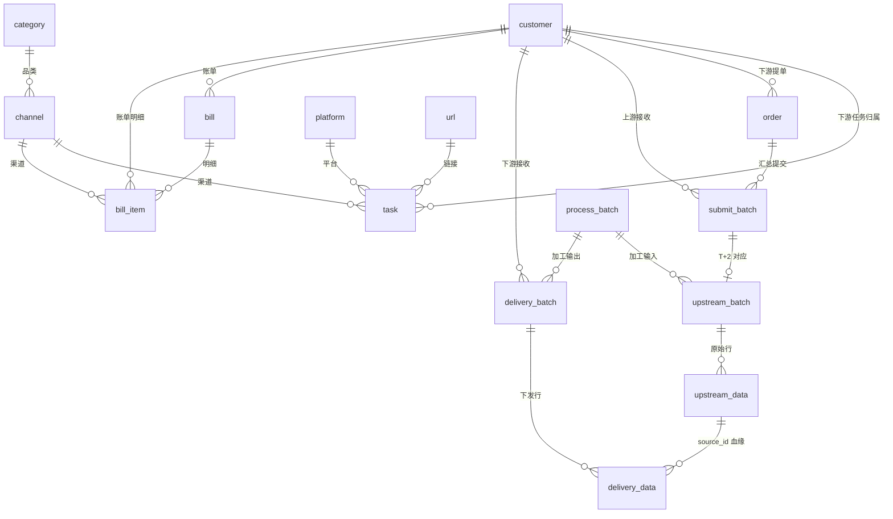

# LM订单管理系统 · Web 系统设计方案

> 日期：2026-09-11 ｜ 面向：日常业务全流程线上化
> 技术选型：**Python(FastAPI) + Vue3 + PostgreSQL**（全新重构，复用现有数据与统计口径）
> 状态：待确认后实施

---

## 0. 与既有文档的关系

| 文档 | 定位 |
|---|---|
| `DESIGN_v3.md` | 上一版血缘方向（SQLite+Flask 增量）—— 本方案吸收其「血缘/追溯」思想 |
| `SCHEMA_V2.md` / `schema_v2.sql` | v2 统计口径（渠道归一化/单价/折扣/洗名/利润）—— 本方案**口径全部沿用** |
| **本文档** | 面向「订单→提单→采集→加工→下发→账单」完整业务闭环的全新系统设计 |

---

## 1. 项目概述

### 1.1 背景
现有系统已积累完整数据资产（227 万交付明细 + 66 万上游原始 + 808 任务 + 9 渠道 + 16 代理 + 公积金 38.8 万），并实现与 BOSS 利润表全等对账。但业务操作（提单、停单、下发、对账、预警）仍散落在 Excel/脚本中，缺少一个**统一支撑日常业务场景**的 Web 系统。

### 1.2 目标
把「接收下游订单 → 汇总提单提交上游 → 接收上游结果 → 加工下发下游 → 账单结算」全流程线上化，实现：
1. **订单/提单/停单**线上化、结构化、可追溯
2. 上游 Excel 结果一键导入，数据流向（来源→加工→去向）全链路可追
3. 数据按任意属性自由组合筛选、自定义表头、导出 Excel
4. 工作台多维度图表（柱/折/雷达/饼）+ 客户业务量排名
5. 停单提醒、账单预警自动触发

### 1.3 设计原则
- **批次贯穿**：一切数据流转以「批次(Batch)」为纽带，天然支持追溯
- **口径复用**：营业额/进货/洗名/利润等统计口径与现有 BOSS 利润表完全一致，杜绝重写口径引入偏差
- **元数据驱动**：列表查询条件、表头、导出字段均为可配置元数据，避免每次改动硬编码
- **幂等可补跑**：每日 ETL 支持 `--date` 补跑任意一天，结果一致

---

## 2. 术语定义

| 术语 | 说明 | 对应现有 |
|---|---|---|
| 上游客户（甲方） | 数据采集供应商，下发采集结果 | `dim_upstream`（新甲方/牛） |
| 下游客户（代理） | 采集需求方，接收加工后数据 | `dim_agent`（660002 财神等 16 个） |
| 品类 | 采集数据类型 | `channel_type`（106/小程序/直播间/DPI-白/DPI-灰） |
| 渠道 | 品类×运营商 的采集规格 | `dim_channel`（106短信劫持/DPI-白 移动 等 9 种） |
| 平台 | 数据来源平台（抖音/快手…） | `daily_records.platform` |
| URL | 采集落地链接 | `lm_tasks.url` |
| 任务 | 采集任务（长期在执/停单） | `dim_task`（808 任务）/ `lm_tasks` |
| 提单 | 下游提交给上游的采集需求（按日汇总） | 每日提单表 |
| 停单 | 下游发起的停止采集指令 | 停单表 |
| 批次(Batch) | 一次数据流转的容器（提单批次/上游批次/下发批次） | 新增 |
| 下发 | 加工后交付下游 | `daily_records`（交付侧） |
| T+2 | 提单日 T → 上游 T+2 下发结果 | 业务周期 |

---

## 3. 核心业务流程

### 3.1 T+2 采集闭环（主链路）

```
T日（提单）                        T+2日（接收+加工+下发）
┌─────────────────┐              ┌──────────────────────────────┐
│ 下游客户提需求    │              │ 上游下发采集结果 Excel          │
│ (采集/停止订单)   │              │   ↓ 导入 upstream_batch        │
│   ↓             │              │   ↓ 加工：去重/洗名/拆分         │
│ 结构化提单汇总    │─────────────→│   ↓ 下发 delivery_batch        │
│ 提交上游         │   等待 T+2    │   ↓ 记账 fact_bill / bill      │
└─────────────────┘              └──────────────────────────────┘
```

### 3.2 提单/停单流程
1. 下游客户（或运营代录）在工作台录入「采集订单」/「停止订单」
2. 系统按**上游客户 + 品类/渠道/平台/URL** 汇总生成结构化提单数据
3. 一键提交 → 生成 `submit_batch`（提单批次，含逐任务清单）
4. 停单同链路，订单类型标记 `stop`，同步更新任务台账状态

### 3.3 数据加工下发流程
1. 上游下发 Excel → 导入 `upstream_batch` + `upstream_data`（逐行，含原始/被剔除行）
2. 加工（按下游客户规则）：去重、洗名、拆分、区域排除 → `process_batch`
3. 生成 `delivery_batch` + `delivery_data`（下发行，`source_id` 指向上游原始行 → 血缘）
4. 记账：数量×单价 → 折扣 → 让利 → 生成 `bill`/`bill_item`

### 3.4 数据血缘追溯
```
order(下游提单) → submit_batch(提交上游) → upstream_batch(上游下发)
    → upstream_data(原始行) → process_batch(加工) → delivery_data(下发行)
        → delivery_batch(下发下游客户) → bill(账单)
```
- **批次级**：`submit_batch ← upstream_batch ← delivery_batch` 链条
- **行级**：`delivery_data.source_id → upstream_data.id`，可追溯某手机号从哪个文件哪一行来

---

## 4. 系统架构

### 4.1 技术选型

| 层 | 选型 | 说明 |
|---|---|---|
| 后端 | **FastAPI** (Python 3.11) | 异步、自动 OpenAPI 文档、Pydantic 校验 |
| ORM | SQLAlchemy 2.0 + Alembic | 迁移管理 |
| 数据库 | **PostgreSQL 15** | 大数据量/复杂聚合/JSONB（自定义配置） |
| 前端 | **Vue3 + TypeScript + Vite** | 组件化、类型安全 |
| UI | Element Plus | 表格/表单/弹窗 |
| 动态表格 | vxe-table | 列显隐/拖拽/排序/导出 |
| 图表 | ECharts 5 | 柱/折/雷达/饼 |
| 任务调度 | APScheduler（内置）/ Celery（可选） | 每日 ETL、预警扫描、T+2 提醒 |
| 部署 | Docker Compose（app + db + nginx） | 单机可跑 |

### 4.2 总体架构

```
┌────────────────────────────────────────────────────────────┐
│ 前端 Vue3 SPA（登录 → 工作台 / 订单 / 数据 / 台账 / 维护 / 预警）│
└──────────────────────────┬─────────────────────────────────┘
                           │ REST + JWT
┌──────────────────────────▼─────────────────────────────────┐
│ FastAPI 后端                                                  │
│  ┌─ 主数据模块 ─ 订单模块 ─ 导入模块 ─ 加工下发 ─ 查询导出 ─┐ │
│  ┌─ 工作台统计 ─ 账单模块 ─ 预警模块 ─ 权限 ─ 操作日志 ────┐ │
│  └─ 调度器（APScheduler：每日 ETL / T+2 提醒 / 预警扫描）───┘ │
└──────────────────────────┬─────────────────────────────────┘
                           │ SQLAlchemy
┌──────────────────────────▼─────────────────────────────────┐
│ PostgreSQL（主库）   ────  文件存储（本地目录，Excel 归档）      │
└────────────────────────────────────────────────────────────┘
```

### 4.3 模块划分

| 模块 | 职责 |
|---|---|
| 主数据 | 客户/品类/平台/渠道/URL/任务 的增删改查 |
| 订单 | 提单/停单录入、汇总、提交上游 |
| 导入 | 上游 Excel 解析入库、文件台账 |
| 加工下发 | 去重/洗名/拆分/排除、下发批次生成 |
| 查询导出 | 数据列表、动态条件/表头、Excel 导出 |
| 工作台 | 日/周/月统计图表、排名、提单/下发快捷操作 |
| 账单 | 客户别账单、利润核算（复用现有口径） |
| 预警 | 停单提醒、账单预警 |
| 系统 | 用户/角色/权限、操作日志 |

---

## 5. 数据库设计

### 5.1 ER 总览



### 5.2 主数据表

**`customer` 客户（上游/下游统一）**
| 字段 | 类型 | 说明 |
|---|---|---|
| id | BIGSERIAL PK | |
| code | TEXT UNIQUE | 660002 / 新甲方 / 牛 |
| name | TEXT | 财神 / 新甲方 |
| type | TEXT | upstream / downstream |
| status | SMALLINT | 1 启用 0 停用 |
| wash_mode | TEXT | 下游加工方式：只分/洗名/合并/跳过 |
| split_by | TEXT | 地区/平台/平铺 |
| is_accounted | BOOLEAN | 是否记账（888888=false） |
| discount | NUMERIC(5,4) | 结算折扣（660003=0.9） |
| discount_start / discount_end | DATE | 折扣窗口 |
| balance | NUMERIC(14,2) | 当前余额（下游） |
| contact / phone | TEXT | 联系方式 |
| note | TEXT | |

**`category` 品类**：id / name / code / sort_no / note

**`platform` 平台**：id / name / code / sort_no / note

**`channel` 渠道（品类×运营商）**
| 字段 | 类型 | 说明 |
|---|---|---|
| id | BIGSERIAL PK | |
| name | TEXT | 账单口径名：106短信劫持 / DPI-白 移动 |
| category_id | FK category | 品类 |
| isp | TEXT | 运营商（移动/联通/电信/NULL） |
| upstream_price | NUMERIC(8,4) | 上游进货单价（成本） |
| sale_price | NUMERIC(8,4) | 下游出货单价（默认，可被客户价覆盖） |
| sort_no | SMALLINT | 账单行位 |
| note | TEXT | |

**`url` 采集链接**：id / url / channel_id / platform_id / status / note

**`task` 任务台账（= 现有 lm_tasks + dim_task）**
| 字段 | 类型 | 说明 |
|---|---|---|
| id | BIGSERIAL PK | |
| name | TEXT UNIQUE | 660002-内江-中银消金 |
| customer_id | FK customer | 下游客户（任务名前 6 位） |
| channel_id | FK channel | 渠道 |
| platform_id | FK platform | 平台 |
| url_id | FK url | 链接 |
| party / chan / isp | TEXT | 甲方/渠道/运营商 |
| qty / dur | TEXT | 数量/时长 |
| prov / city | TEXT | 地区 |
| start_date / end_date | DATE | 在执起止 |
| status | TEXT | 在执/停单/已停止 |
| remark | TEXT | 备注 |
| first_seen / last_seen | DATE | 首末在执 |

### 5.3 订单表

**`order` 提单/停单**
| 字段 | 类型 | 说明 |
|---|---|---|
| id | BIGSERIAL PK | |
| order_no | TEXT UNIQUE | 订单号 |
| order_type | TEXT | collect(采集) / stop(停止) |
| customer_id | FK customer | 下游客户 |
| task_id | FK task | 任务 |
| biz_date | DATE | 提单日期 T |
| qty | INTEGER | 需求数量 |
| status | TEXT | 待提交/已提交/采集中/已完成/已停止/已取消 |
| stop_reason | TEXT | 停单原因 |
| submit_batch_id | FK | 所属提交批次 |
| remark | TEXT | |
| created_at / updated_at | TIMESTAMPTZ | |

**`submit_batch` 提交上游批次**
| 字段 | 类型 | 说明 |
|---|---|---|
| id | BIGSERIAL PK | |
| batch_no | TEXT UNIQUE | 提单批次号 |
| upstream_id | FK customer | 上游客户 |
| biz_date | DATE | 提单日 T |
| order_count | INTEGER | 汇总订单数 |
| total_qty | INTEGER | 汇总需求数量 |
| status | TEXT | 待提交/已提交/已接收/已停止 |
| submitted_at / submitted_by | | 提交时间/人 |
| note | TEXT | |

### 5.4 数据流表

**`upstream_batch` 上游下发批次**
| 字段 | 类型 | 说明 |
|---|---|---|
| id | BIGSERIAL PK | |
| batch_no | TEXT UNIQUE | 上游批次号 |
| upstream_id | FK customer | 上游 |
| submit_batch_id | FK | 对应提单批次（T+2 关联） |
| biz_date | DATE | 下发日期 T+2 |
| file_name / file_path | TEXT | Excel 文件 |
| row_count | INTEGER | 原始行数 |
| dedup_count | INTEGER | 去重删除数 |
| status | TEXT | 已导入/已加工/已下发 |
| note | TEXT | |

**`upstream_data` 上游原始数据行（逐行，含被剔除）**
| 字段 | 类型 | 说明 |
|---|---|---|
| id | BIGSERIAL PK | |
| batch_id | FK upstream_batch | 批次 |
| row_no | INTEGER | 文件行号 |
| phone | TEXT | 手机号（索引） |
| name | TEXT | 姓名（洗名后回填） |
| platform | TEXT | 平台 |
| province / city | TEXT | 省市 |
| task_name | TEXT | 任务 |
| status | TEXT | 待处理/已交付/已剔除/积压 |
| drop_reason | TEXT | 剔除原因：任务内重复/平台库重复/大库重复/区域限制/排除任务 |
| raw | TEXT | 原始行（JSON） |
| created_at | TIMESTAMPTZ | |

**`process_batch` 加工批次**
| 字段 | 类型 | 说明 |
|---|---|---|
| id | BIGSERIAL PK | |
| batch_no | TEXT | 加工批次号 |
| input_batch_id | FK upstream_batch | 输入 |
| process_type | TEXT | 去重/洗名/拆分/排除 |
| customer_id | FK | 目标下游客户 |
| input_count / output_count | INTEGER | 加工前后数量 |
| created_at | TIMESTAMPTZ | |

**`delivery_batch` 下发批次**
| 字段 | 类型 | 说明 |
|---|---|---|
| id | BIGSERIAL PK | |
| batch_no | TEXT | 下发批次号 |
| customer_id | FK customer | 下游客户 |
| biz_date | DATE | 下发日期 |
| row_count | INTEGER | 行数 |
| status | TEXT | 待下发/已下发 |
| note | TEXT | |

**`delivery_data` 下发数据行（= 现有 daily_records 重构）**
| 字段 | 类型 | 说明 |
|---|---|---|
| id | BIGSERIAL PK | |
| delivery_batch_id | FK | 下发批次 |
| source_id | FK upstream_data | **血缘：上游原始行** |
| phone / platform / province / city | TEXT | |
| name | TEXT | 洗名姓名 |
| channel_id | FK channel | 渠道 |
| task_name | TEXT | 任务 |
| is_wash / wash_status | | 洗名标记 |
| created_at | TIMESTAMPTZ | |

> 索引：`phone`、`biz_date`、`customer_id`、`channel_id`、`source_id`

### 5.5 账务表（口径复用现有 v2）

**`bill_item` 账单明细（= fact_bill）**：customer_id / biz_date / channel_id / qty / unit_price
**`bill` 客户账单（= bill_daily）**：customer_id / biz_date / qty / sales / cost / wash_fee / profit / balance

**口径（与 BOSS 利润表全等）**
```
营业额(净) = Σ代理 毛额(qty×出货单价) → 折扣(dim_agent.discount) → 让利(bill_adjust)
进货成本   = Σ(交付量 × 渠道上游价 channel.upstream_price)（可 purchase_override 覆盖）
洗名费     = (唯一值 − 未命中) × 0.012
利润       = 营业额 − 进货成本 − 洗名费
```

**补充**：`bill_adjust`（让利/补数）、`purchase_override`（进货覆盖）、`fact_wash`（洗名）、`fact_balance`（余额快照）沿用现有表结构。

### 5.6 配置 / 元数据表

**`data_field` 字段字典**（各模块可查询/展示/导出字段）
| 字段 | 说明 |
|---|---|
| id / module / field_key / label / data_type / sortable / filterable / exportable | 字段定义 |

**`query_template` 查询方案**（用户自定义列+条件）
| 字段 | 说明 |
|---|---|
| id / name / module / user_id / columns(JSONB) / filters(JSONB) / sort(JSONB) / is_public | 保存查询配置 |

**`alert_rule` 预警规则**
| 字段 | 说明 |
|---|---|
| id / type(停单提醒/账单预警) / name / condition(JSONB) / level / enabled | 规则定义 |

**`alert` 预警记录**：id / rule_id / biz_date / title / content / level / status(未读/已读/已处理) / created_at

**`file_registry` 文件台账**：id / file_name / file_path / biz_date / row_count / source_type(上游/交付/提单) / status / imported_at

### 5.7 账户与权限表（RBAC）

**`sys_user` 账户**
| 字段 | 类型 | 说明 |
|---|---|---|
| id | BIGSERIAL PK | |
| username | TEXT UNIQUE | 登录名：admin / lemon001 / lemon002 |
| password_hash | TEXT | bcrypt 加密 |
| nickname | TEXT | 显示名 |
| role_id | FK sys_role | 角色 |
| status | SMALLINT | 1 启用 0 停用 |
| must_change_pwd | BOOLEAN | 首次登录强制改密 |
| last_login_at | TIMESTAMPTZ | |
| created_at / updated_at | TIMESTAMPTZ | |

**`sys_role` 角色**：id / name / code / is_builtin / data_scope(数据权限范围) / note

**`sys_permission` 权限点字典**：id / code / label / module
> 权限点编码规范：`模块:动作`，如 `account:view`、`account:edit`、`order:view`、`data:view`、`bill:view`…

**`sys_role_permission` 角色-权限关联**：role_id / permission_id

**`operation_log` 操作日志**：id / user_id / username / module / action / target / detail / ip / created_at

**内置账户（初始化 seed）**
| 用户名 | 初始密码 | 角色 | 权限 |
|---|---|---|---|
| admin | 首次登录强制修改 | 超级管理员 | **全部权限**（含账户维护：查看/新增/编辑/重置密码/启停/分配角色） |
| lemon001 | 首次登录强制修改 | 运营 | 业务全部权限；**无账户维护权限**（无 `account:view`/`account:edit`） |
| lemon002 | 首次登录强制修改 | 运营 | 业务全部权限；**无账户维护权限** |

> 账户维护（`account:*`）仅超级管理员角色拥有；lemon001/lemon002 登录后不显示「账户管理」菜单，且后端对 `/api/users`、`/api/roles` 接口做权限拦截（前端隐藏 + 后端校验双层）。

---

## 6. 功能模块详细设计

### 6.1 基础数据管理（主数据）
- 品类 / 平台 / 渠道 / URL / 任务 / 客户 六个维护页，通用 CRUD + 启停 + 导入
- 渠道页：维护上游价/下游价，支撑成本与利润计算
- 任务页：维护在执状态、起止日期、url、备注（停单入口）
- 客户页：维护加工方式、折扣、记账开关、余额

### 6.2 订单管理（提单/停单）
- **提单录入**：选下游客户 + 任务（自动带出渠道/平台/url）→ 填数量 → 生成订单
- **批量提单**：Excel 批量导入订单
- **停单**：对在执任务发起停单，填原因，状态流转
- **汇总提交**：按上游客户汇总当日 `collect` 订单 → 生成 `submit_batch` → 导出提单表 Excel / 在线提交
- **状态看板**：待提交/已提交/采集中/已完成/已停止 各状态数量

### 6.3 上游数据导入
- 上传上游 Excel（或选择归档目录）→ 解析 → `upstream_batch` + `upstream_data`
- 解析器复用现有 `importer.py` 逻辑（6 列主文件 / detail json / 分代理目录）
- 导入后自动触发加工下发流程（幂等）
- `file_registry` 登记文件台账（谁、哪个文件、几行、何时到）

### 6.4 数据加工与下发
- 加工规则按客户配置：去重、洗名、拆分、区域排除
- 生成 `delivery_batch` 下发各下游客户，导出下发 Excel
- **数量守恒校验**：收进 = 交付 + 剔除 + 积压，不平红字告警

### 6.5 数据查询与追溯
- 列表：上游数据 / 下发数据 / 订单 / 批次 / 任务 各列表页
- **数据流向追溯**：
  - 批次视图：点某批次 → 看来源提单、上游原始、加工、下发去向一屏贯穿
  - 手机号全息：输入手机号 → 时间线（供给→加工→交付→剔除）+ 姓名/公积金命中 + 复用价值标记

### 6.6 自定义表格与导出（核心能力）
- 所有列表页：查询条件、表头列均支持**动态增减、排序、显隐**
- 条件自由组合：平台 / 品类 / 渠道 / 来源(上游) / 去向(下游) / 创建日期 / 期间 等任意属性
- 查询方案保存/加载（`query_template`），可设为团队共享
- 导出：按当前条件 + 选中列导出 Excel（分页/流式导出，支持大数据量）
- 字段能力来自 `data_field` 字典，新增字段无需改前端代码

### 6.7 工作台
- **指标卡**：今日/本周/本月 上游订单量、上游数据量、下游订单量、下游数据量、营收、利润
- **图表**（粒度日/周/月可切换）：
  | 图表 | 内容 |
  |---|---|
  | 柱状图 | 每日/周/月 数据量对比（上游 vs 下游） |
  | 折线图 | 订单量/数据量/利润 趋势 |
  | 饼图 | 品类/平台/渠道 占比 |
  | 雷达图 | 客户多维度对比（订单量/数据量/利润/履约率） |
  | 排名表 | 下游客户业务量统计排名 |
- **快捷操作**：工作台内直接提单、下发、处理待提交批次
- **客户别**：客户别利润、客户别账单（柱状 + 明细下钻）

### 6.8 预警中心
- **停单提醒**：任务在执时长/到期日触发（如 start_date 距今超 N 天，或到达 end_date）→ 提醒是否停单
- **账单预警**：客户余额低于阈值 / 账期到期 / 利润异常 → 提醒
- 预警列表 + 已读/处理状态；规则可在 `alert_rule` 配置
- 调度器定时扫描（APScheduler）

### 6.9 账单管理
- 客户别账单生成、查看、导出
- 单价/折扣/让利维护（复用现有口径函数）
- 进货覆盖、洗名费、余额快照维护
- 与利润表对账报告（复用现有 `verify_against_profit_files` 思路）

### 6.10 登录与账户管理
- **登录**：用户名 + 密码 → JWT；首次登录或重置后强制改密；连续失败锁定；支持退出
- **账户维护（仅超级管理员 admin 可见/可用）**：
  - 账户列表：查看 / 新增 / 编辑 / 重置密码 / 启用停用 / 分配角色
  - 角色管理：角色 CRUD + 权限点勾选
- **权限控制**：菜单级（导航按权限渲染）+ 接口级（后端鉴权拦截）+ 数据级（`data_scope` 控制可见的上游/下游客户）
- **本人信息**：任意账户可修改自己的昵称/密码（非账户维护权限）
- 全量操作写 `operation_log`

---

## 7. API 设计（RESTful，FastAPI 自动生成 OpenAPI）

| 模块 | 端点 |
|---|---|
| 认证 | `POST /api/auth/login` `POST /api/auth/logout` `GET /api/auth/me` `POST /api/auth/change-password` |
| 账户（仅超管） | `/api/users`（CRUD + 重置密码 + 启停）`/api/roles`（CRUD）`/api/permissions`（权限点字典） |
| 主数据 | `/api/customers` `/api/categories` `/api/platforms` `/api/channels` `/api/urls` `/api/tasks`（CRUD） |
| 订单 | `/api/orders`（CRUD）`POST /api/orders/import` `POST /api/orders/submit`（生成 submit_batch） |
| 提交 | `/api/submit-batches` |
| 导入 | `POST /api/upstream/import`（Excel 上传）`/api/upstream-batches` `/api/upstream-data` |
| 加工下发 | `POST /api/process/run` `/api/delivery-batches` `/api/delivery-data` |
| 查询导出 | `POST /api/query/{module}`（动态条件）`POST /api/export/{module}`（导出）`/api/query-templates` |
| 追溯 | `GET /api/trace/batch/{id}` `GET /api/trace/phone/{phone}` |
| 工作台 | `GET /api/dashboard/summary` `GET /api/dashboard/trend` `GET /api/dashboard/rank` |
| 账单 | `/api/bills` `/api/bill-items` `/api/bill-adjust` `/api/purchase-override` `/api/wash` |
| 预警 | `/api/alerts` `/api/alert-rules` |
| 系统 | `/api/logs` `/api/files` |

统一响应：`{code, data, msg}`；鉴权 JWT；操作写 `operation_log`。

---

## 8. 权限与安全

- **RBAC 角色**：超级管理员 / 运营 / 财务 / 只读（`sys_role` 可扩展）
- **内置账户**：
  - `admin`（超级管理员）：全部权限，**唯一可查看与维护账户信息**
  - `lemon001` / `lemon002`（运营）：业务全部权限，**无账户信息查看/维护权限**
- **双层鉴权**：前端按权限渲染菜单/按钮 + 后端对每个接口做权限校验（缺一不可，防止绕过前端直接调接口）
- **密码安全**：bcrypt 哈希存储；初始密码强制首次登录修改；连续 5 次失败锁定 15 分钟
- 权限：菜单级 + 操作级（`模块:动作`）+ 数据级（`data_scope` 是否可见某上游/下游客户）
- 手机号属敏感个人信息：默认本机/内网部署，禁止同步云盘；DB 访问白名单
- 操作日志：登录 / 提单 / 下发 / 改价 / 导出 / 账户维护 全留痕

---

## 9. 部署与运维

- **Docker Compose**：`postgres` + `fastapi` + `nginx`（前端静态）三容器
- **文件存储**：本地挂载目录，Excel 归档；文件台账 `file_registry` 记录
- **调度器**：APScheduler 内置（每日 ETL、T+2 提醒、预警扫描），或 Celery+Beat
- **备份**：PostgreSQL 每日 `pg_dump` + WAL；文件目录同步备份
- **监控**：日志 + 健康检查端点 `/healthz`

---

## 10. 迁移方案（复用现有数据/口径）

| 现有 | 迁移到 | 说明 |
|---|---|---|
| `dim_agent` / `agents` | `customer`(type=downstream) | 16 代理 + 加工/折扣/记账/余额 |
| `dim_upstream` / `upstreams` | `customer`(type=upstream) | 新甲方/牛 |
| `dim_channel` | `channel` | 9 渠道 + 上游价/下游价 |
| `dim_task` / `lm_tasks` | `task` | 808 任务 + 台账字段 |
| `daily_records`(227万) | `delivery_data` | 回填交付侧，`biz_date` 8/24、8/30~9/9 |
| `upstream_raw`(66万) | `upstream_data` | 回填供给侧 8/22 起 |
| 每日提单表(0830~0909) | `order` + `submit_batch` | 回填需求侧（历史可全回填） |
| `agent_prices` | 价格历史 | 单价快照来源 |
| `fact_bill`/`bill_daily`/`fact_wash`/`fact_balance` | `bill`/`bill_item`/`fact_wash`/`fact_balance` | 账务口径原样复用 |
| 口径函数 `v2.py` | 后端 service 层 | `norm_channel`/`eff_price`/`discount_factor`/`sales_rows`/`day_profit` 平移 |

**回填注意**：剔除/积压明细过去未留痕，历史只能总量差额估算；从上线日起记全。

---

## 11. 里程碑规划

| 阶段 | 内容 | 预估 |
|---|---|---|
| M1 基础 | 项目脚手架 + PostgreSQL + 主数据 CRUD + 登录权限 | 2 天 |
| M2 订单 | 提单/停单/汇总提交/批量导入 | 2 天 |
| M3 数据流 | 上游导入 + 加工下发 + 批次 + 血缘追溯 | 3 天 |
| M4 查询导出 | 动态表格 + 查询方案 + Excel 导出 | 2 天 |
| M5 工作台 | 图表/排名/快捷操作 | 2 天 |
| M6 账务预警 | 账单 + 对账 + 停单提醒/账单预警 | 2 天 |
| M7 迁移 | 历史数据回填 + 口径对账验证 + 上线 | 2 天 |

---

## 12. 待确认事项

1. 上游/下游客户是否统一 `customer` 表（建议统一，type 区分）
2. 订单粒度：按「任务×日」还是支持多明细订单
3. 是否引入 Celery（数据量大时异步导入/导出），还是先 APScheduler 内置够用
4. 数据权限范围（是否按账户区分可见的上游/下游客户；当前默认全员可见全部客户）
5. 停单提醒阈值（在执超 N 天？到期前 M 天？）
6. 历史回填范围（8/22 起还是更早）
