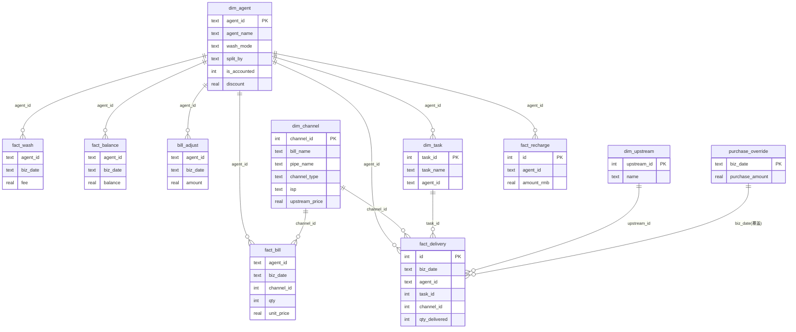
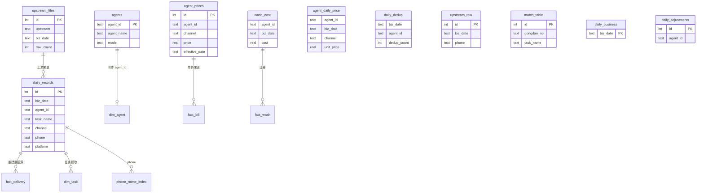
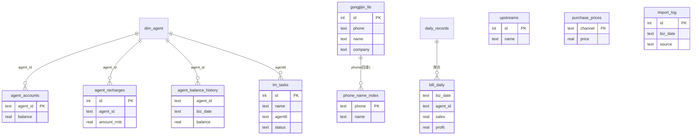

# 嘟嘟业务数据管理系统 · 数据库 ER 图

> 共 32 张表（SQLite，无物理外键，全部为逻辑 ID 引用）
> 分层：核心星型(v2 统计层) / 明细与旧表(v1 数据源) / 账务与扩展

## 一、核心星型结构（v2 统计层）



## 二、明细层与旧表（v1，数据源）



## 三、账务层与扩展表



## 四、分层一览（含行数，2026-09-10 实测）

| 层 | 表 | 行数 | 说明 |
|---|---|---|---|
| **维度(4)** | dim_agent / dim_channel / dim_task / dim_upstream | 17 / 9 / 808 / 2 | 代理/渠道/任务/上游字典 |
| **事实(7)** | fact_delivery / fact_bill / fact_wash / fact_recharge / fact_balance / purchase_override / bill_adjust | 4820 / 239 / 37 / 0 / 126 / 1 / 5 | 每日交付/账单/洗名/充值/余额/进货覆盖/让利 |
| **明细(1)** | daily_records | 227 万 | 手机号级原库（统计外，仅供回查/平台） |
| **旧规则(9)** | agents / agent_prices / agent_daily_price / daily_dedup / wash_cost / daily_business / daily_adjustments / match_table / purchase_prices | — | v1 遗留，逐步被 v2 替代 |
| **上游(3)** | upstream_files / upstream_raw / upstreams | 31 / 66 万 / 2 | 甲方文件归档 + 原始转储 |
| **账务(3)** | agent_accounts / agent_recharges / agent_balance_history | 16 / 21 / 0 | 账户/充值/余额 |
| **扩展(4)** | lm_tasks / gongjijin_lib / phone_name_index / bill_daily | 580 / 41 万 / 12.6 万 / 147 | 任务台账/公积金名单/姓名索引/账单汇总 |

## 五、关键数据流关系

```
daily_records(227万行) ──v2.rebuild_date()──> fact_delivery / fact_bill（统计层唯一数据源）
agent_prices(123条)     ──eff_price()───────> fact_bill.unit_price（单价快照来源）
agents                  ──sync_dim_agent()──> dim_agent（旧表同步，不覆盖折扣/开关）
wash_cost               ──rebuild_fact_wash()──> fact_wash（迁移）
upstream_files          ──api/daily─────────> 上游来量(入)
bill_adjust + discount  ──sales_rows()──────> 营业额(净)
```

## 六、ER 图渲染方式

- 在线：把上面任一 `mermaid` 代码块粘贴到 https://mermaid.live
- VSCode：安装「Markdown Preview Mermaid Support」插件后直接预览本文件
- 本地：`npx -y @mermaid-js/mermaid-cli -i ER.md -o ER.svg`（需 `-f` 指定包含 mermaid 的输入）
