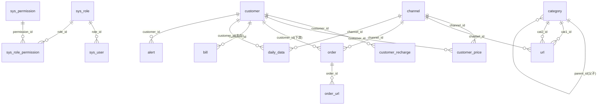

# LM订单管理系统 · 数据库表设计

> 依据当前原型（docs/prototype.html）实体与字段整理。
> 数据库：PostgreSQL（沿用 DESIGN_WEB.md 选型）。
> 命名约定：主数据/业务表用单数名词，关联表 `a_b`；主键 `id BIGSERIAL`；通用时间字段 `created_at/updated_at`，状态字段 `status`。

---

## 一、表清单（16 张）

| 分类 | 表 | 说明 |
|---|---|---|
| 系统 | `sys_user` | 账户（admin/lemon001/lemon002） |
| 系统 | `sys_role` | 角色 |
| 系统 | `sys_permission` | 权限点 |
| 系统 | `sys_role_permission` | 角色-权限关联 |
| 主数据 | `customer` | 客户（上游/下游） |
| 主数据 | `customer_recharge` | 客户充值记录 |
| 主数据 | `customer_price` | 客户×渠道 单价 |
| 主数据 | `category` | 品类（一级/二级，自关联父子） |
| 主数据 | `channel` | 渠道 |
| 主数据 | `operator` | 运营商组合 |
| 主数据 | `url` | 配件/URL（含等级） |
| 业务 | `order` | 订单 |
| 业务 | `order_url` | 订单多 URL |
| 业务 | `daily_data` | 日活数据（公积金以外） |
| 业务 | `fund` | 公积金名单 |
| 业务 | `bill` | 账单（每日代理） |
| 业务 | `alert` | 预警 |
| 通用 | `operation_log` | 操作日志 |

---

## 二、ER 图



---

## 三、DDL（PostgreSQL）

### 1. 系统：账户与权限

```sql
CREATE TABLE sys_role (
    id          BIGSERIAL PRIMARY KEY,
    name        VARCHAR(50)  NOT NULL,          -- 超级管理员/运营/财务/只读
    code        VARCHAR(50)  NOT NULL UNIQUE,   -- admin/operator/finance/readonly
    is_builtin  BOOLEAN      DEFAULT FALSE,
    note        TEXT,
    created_at  TIMESTAMPTZ  DEFAULT now()
);

CREATE TABLE sys_user (
    id               BIGSERIAL PRIMARY KEY,
    username         VARCHAR(50)  NOT NULL UNIQUE,  -- admin/lemon001/lemon002
    password_hash    VARCHAR(200) NOT NULL,         -- bcrypt
    nickname         VARCHAR(50),
    role_id          BIGINT REFERENCES sys_role(id),
    status           SMALLINT     DEFAULT 1,        -- 1启用 0停用
    must_change_pwd  BOOLEAN      DEFAULT TRUE,     -- 首次登录强制改密
    last_login_at    TIMESTAMPTZ,
    created_at       TIMESTAMPTZ  DEFAULT now(),
    updated_at       TIMESTAMPTZ  DEFAULT now()
);

CREATE TABLE sys_permission (
    id     BIGSERIAL PRIMARY KEY,
    code   VARCHAR(100) NOT NULL UNIQUE,  -- account:view / order:edit / ...
    label  VARCHAR(100) NOT NULL,
    module VARCHAR(50)
);

CREATE TABLE sys_role_permission (
    role_id       BIGINT NOT NULL REFERENCES sys_role(id),
    permission_id BIGINT NOT NULL REFERENCES sys_permission(id),
    PRIMARY KEY (role_id, permission_id)
);
```

### 2. 主数据：客户

```sql
CREATE TABLE customer (
    id            BIGSERIAL PRIMARY KEY,
    code          VARCHAR(50)  NOT NULL UNIQUE,  -- 客户编号 660002 / 新甲方
    name          VARCHAR(100) NOT NULL,         -- 客户名称 财神
    ctype         VARCHAR(20)  NOT NULL,         -- upstream / downstream
    tg_id         VARCHAR(100),                  -- 飞机账号ID t.me/xxx
    wash_mode     VARCHAR(20)  DEFAULT '只分',    -- 加工方式 只分/洗名/合并/跳过
    is_accounted  BOOLEAN      DEFAULT TRUE,     -- 是否记账
    discount      NUMERIC(5,4) DEFAULT 1,        -- 结算折扣
    balance       NUMERIC(14,2) DEFAULT 0,       -- 余额
    warn_amount   NUMERIC(14,2) DEFAULT 0,       -- 账单预警额度
    note          TEXT,
    status        SMALLINT     DEFAULT 1,        -- 启用/停用
    created_at    TIMESTAMPTZ  DEFAULT now(),
    updated_at    TIMESTAMPTZ  DEFAULT now()
);

-- 充值记录（客户详情·充值记录 tab）
CREATE TABLE customer_recharge (
    id            BIGSERIAL PRIMARY KEY,
    customer_id   BIGINT NOT NULL REFERENCES customer(id),
    recharge_date DATE   NOT NULL,
    amount_u      NUMERIC(14,2) NOT NULL,   -- 充值金额 U
    amount_rmb    NUMERIC(14,2),            -- 折算 RMB（=U×汇率）
    note          TEXT,
    created_at    TIMESTAMPTZ DEFAULT now()
);
CREATE INDEX idx_recharge_customer ON customer_recharge(customer_id, recharge_date);

-- 客户×渠道 单价（客户详情·单价管理 tab，数据来源=渠道）
CREATE TABLE customer_price (
    id            BIGSERIAL PRIMARY KEY,
    customer_id   BIGINT NOT NULL REFERENCES customer(id),
    channel_id    BIGINT NOT NULL REFERENCES channel(id),
    price         NUMERIC(8,4) NOT NULL,    -- 单价 元/条
    created_at    TIMESTAMPTZ DEFAULT now(),
    updated_at    TIMESTAMPTZ DEFAULT now(),
    UNIQUE (customer_id, channel_id)
);
```

### 3. 主数据：品类 / 渠道 / 运营商

```sql
-- 品类：一级/二级父子（parent_id 自关联，NULL=一级）
CREATE TABLE category (
    id         BIGSERIAL PRIMARY KEY,
    name       VARCHAR(100) NOT NULL,       -- 贷款/银行/教育/学历...
    parent_id  BIGINT REFERENCES category(id),  -- 二级品类指向其一级品类
    level      SMALLINT NOT NULL,           -- 1 一级 / 2 二级
    sort_no    SMALLINT DEFAULT 0,
    status     SMALLINT DEFAULT 1,
    created_at TIMESTAMPTZ DEFAULT now(),
    updated_at TIMESTAMPTZ DEFAULT now()
);
CREATE INDEX idx_category_parent ON category(parent_id);

-- 渠道（单表维护）
CREATE TABLE channel (
    id         BIGSERIAL PRIMARY KEY,
    name       VARCHAR(100) NOT NULL UNIQUE,  -- 106/小程序/dpi-白/dpi-灰
    status     SMALLINT DEFAULT 1,
    created_at TIMESTAMPTZ DEFAULT now(),
    updated_at TIMESTAMPTZ DEFAULT now()
);

-- 运营商（移动/联通/电信及自由组合）
CREATE TABLE operator (
    id         BIGSERIAL PRIMARY KEY,
    name       VARCHAR(50) NOT NULL UNIQUE,  -- 移动 / 联通 / 移动+联通 ...
    status     SMALLINT DEFAULT 1,
    created_at TIMESTAMPTZ DEFAULT now(),
    updated_at TIMESTAMPTZ DEFAULT now()
);
```

### 4. 主数据：配件/URL（可标记等级）

```sql
CREATE TABLE url (
    id          BIGSERIAL PRIMARY KEY,
    owner       VARCHAR(50)  NOT NULL,   -- 归属方 LM/知南/牛牛
    cat1_id     BIGINT REFERENCES category(id),  -- 一级品类
    cat2_id     BIGINT REFERENCES category(id),  -- 二级品类
    channel_id  BIGINT REFERENCES channel(id),   -- 渠道
    url         TEXT NOT NULL,           -- 链接
    level       VARCHAR(10) DEFAULT '中', -- 等级 高/中/低
    status      SMALLINT DEFAULT 1,
    created_at  TIMESTAMPTZ DEFAULT now(),
    updated_at  TIMESTAMPTZ DEFAULT now()
);
CREATE INDEX idx_url_channel ON url(channel_id);
CREATE INDEX idx_url_cat2    ON url(cat2_id);
```

### 5. 业务：订单 + 订单多 URL

```sql
CREATE TABLE "order" (
    id            BIGSERIAL PRIMARY KEY,
    order_no      VARCHAR(50)  NOT NULL UNIQUE,  -- 订单号 DD20260911001
    customer_id   BIGINT REFERENCES customer(id), -- 下游
    upstream      VARCHAR(50),                   -- 上游 新甲方/牛
    channel_id    BIGINT REFERENCES channel(id), -- 渠道
    task_name     VARCHAR(200),                  -- 任务名
    qty           INTEGER,                       -- 数量
    province      VARCHAR(500),                  -- 省份（多值｜分隔）
    city          VARCHAR(500),                  -- 地市（多值｜分隔）
    excl_province VARCHAR(500),                  -- 排除省
    excl_city     VARCHAR(500),                  -- 排除市
    age_min       INTEGER,                       -- 年龄下限
    age_max       INTEGER,                       -- 年龄上限
    pv            INTEGER,                       -- PV
    start_date    DATE,                          -- 开始日期
    end_date      DATE,                          -- 截止日期
    stop_date     DATE,                          -- 停单日期
    status        VARCHAR(20) DEFAULT '已提交',   -- 已提交/在执中/已停单
    created_at    TIMESTAMPTZ DEFAULT now(),
    updated_at    TIMESTAMPTZ DEFAULT now()
);
CREATE INDEX idx_order_customer ON "order"(customer_id);
CREATE INDEX idx_order_status   ON "order"(status);

-- 订单多 URL（订单列表 URL 列点开详情）
CREATE TABLE order_url (
    id       BIGSERIAL PRIMARY KEY,
    order_id BIGINT NOT NULL REFERENCES "order"(id),
    url      TEXT NOT NULL,
    level    VARCHAR(10) DEFAULT '中',  -- 高/中/低
    sort_no  SMALLINT DEFAULT 0
);
CREATE INDEX idx_order_url_order ON order_url(order_id);
```

### 6. 业务：日活数据（公积金以外）

```sql
CREATE TABLE daily_data (
    id            BIGSERIAL PRIMARY KEY,
    cat1_id       BIGINT REFERENCES category(id),  -- 一级品类
    cat2_id       BIGINT REFERENCES category(id),  -- 二级品类
    platform      VARCHAR(50),                     -- 平台
    channel_id    BIGINT REFERENCES channel(id),   -- 渠道
    phone         VARCHAR(20) NOT NULL,            -- 手机号
    name          VARCHAR(50),                     -- 姓名
    upstream      VARCHAR(50),                     -- 来源(上游)
    customer_id   BIGINT REFERENCES customer(id),  -- 去向(下游)
    task_name     VARCHAR(200),                    -- 任务
    province      VARCHAR(500),                    -- 省份
    city          VARCHAR(500),                    -- 地市
    excl_province VARCHAR(500),                    -- 排除省
    excl_city     VARCHAR(500),                    -- 排除市
    wash_status   VARCHAR(20),                     -- 洗名状态
    biz_date      DATE NOT NULL,                   -- 创建日期
    created_at    TIMESTAMPTZ DEFAULT now()
);
CREATE INDEX idx_daily_phone ON daily_data(phone);
CREATE INDEX idx_daily_date  ON daily_data(biz_date);
CREATE INDEX idx_daily_cust  ON daily_data(customer_id);
```

### 7. 业务：公积金名单

```sql
CREATE TABLE fund (
    id             BIGSERIAL PRIMARY KEY,
    phone          VARCHAR(20) NOT NULL,   -- 手机号
    name           VARCHAR(50),            -- 姓名
    id_card        VARCHAR(30),            -- 身份证号
    gender         VARCHAR(10),            -- 性别
    province       VARCHAR(50),            -- 省份
    city           VARCHAR(50),            -- 地市
    company        VARCHAR(200),           -- 单位名称
    company_type   VARCHAR(50),            -- 单位性质
    base           NUMERIC(14,2),          -- 缴存基数
    ratio          VARCHAR(20),            -- 缴存比例
    monthly        NUMERIC(14,2),          -- 月缴存额
    balance        NUMERIC(14,2),          -- 账户余额
    deposit_status VARCHAR(20),            -- 缴存状态
    open_date      VARCHAR(20),            -- 开户日期
    pay_to         VARCHAR(20),            -- 缴至年月
    operator       VARCHAR(20),            -- 运营商
    source_file    VARCHAR(200),           -- 来源文件
    created_at     TIMESTAMPTZ DEFAULT now()
);
CREATE INDEX idx_fund_phone ON fund(phone);
CREATE UNIQUE INDEX ux_fund_phone_src ON fund(phone, source_file);
```

### 8. 业务：账单（每日代理）

```sql
CREATE TABLE bill (
    id           BIGSERIAL PRIMARY KEY,
    customer_id  BIGINT NOT NULL REFERENCES customer(id),
    biz_date     DATE   NOT NULL,         -- 业务日期
    purchase_qty INTEGER DEFAULT 0,       -- 进货量
    sales        NUMERIC(14,2) DEFAULT 0, -- 销售金额
    balance      NUMERIC(14,2) DEFAULT 0, -- 余额
    profit       NUMERIC(14,2) DEFAULT 0, -- 利润
    created_at   TIMESTAMPTZ DEFAULT now() -- 创建日期
);
CREATE UNIQUE INDEX ux_bill_cust_date ON bill(customer_id, biz_date);
```

### 9. 业务：预警

```sql
CREATE TABLE alert (
    id           BIGSERIAL PRIMARY KEY,
    level        VARCHAR(10) NOT NULL,    -- 提醒/预警
    type         VARCHAR(20) NOT NULL,    -- 停单提醒/账单预警
    customer_id  BIGINT REFERENCES customer(id), -- 客户名
    task_name    VARCHAR(200),            -- 任务名
    content      TEXT,                    -- 内容
    trigger_time TIMESTAMPTZ,             -- 触发时间（停单日到达当日触发）
    status       VARCHAR(20) DEFAULT '未处理', -- 未处理/已处理
    created_at   TIMESTAMPTZ DEFAULT now()
);
CREATE INDEX idx_alert_status ON alert(status);
```

### 10. 通用：操作日志

```sql
CREATE TABLE operation_log (
    id         BIGSERIAL PRIMARY KEY,
    user_id    BIGINT,
    username   VARCHAR(50),
    module     VARCHAR(50),   -- 订单/客户/配件/...
    action     VARCHAR(50),   -- 新增/编辑/删除/导入/导出/停单/充值
    target     VARCHAR(200),  -- 操作对象标识
    detail     TEXT,
    ip         VARCHAR(50),
    created_at TIMESTAMPTZ DEFAULT now()
);
```

---

## 四、关键口径与规则

| 规则 | 说明 |
|---|---|
| 状态（订单） | 已提交 / 在执中 / 已停单；业务日期 +2 天后自动「已提交 → 在执中」 |
| 省份/地市互斥 | `order.daily_data` 中 province 与 city 不同时有值；多值用 `｜` 分隔 |
| 全国→排除省份 / 单省→排除地市 | 通过 `excl_province` / `excl_city` 表达 |
| 等级 | `url.level`、`order_url.level` 取值 高/中/低 |
| 品类父子 | `category.parent_id` 自关联，`level=1/2` |
| 客户总供货量/总销售额/总利润 | 视图/聚合现算，不落库（`daily_data` 供货量 + `bill` 销售额/利润） |
| 单价 | 客户×渠道 单价存 `customer_price`；出货额 = qty × 单价 |
| 账户权限 | `sys_role_permission`；lemon001/lemon002 无 `account:*` 权限 |

---

## 五、索引与性能备注

- 大表 `daily_data`（手机号级，日增量万级）：`phone`、`biz_date`、`customer_id` 均建索引
- `fund`：`phone` 索引 + `(phone, source_file)` 唯一（幂等导入）
- `order`：`customer_id`、`status` 索引；`order_url` 按 `order_id` 索引
- 明细表建议按季度归档，汇总表（bill 等）永久保留

---

## 六、旧库迁移映射（dudu.db → LM 新库）

### 6.1 表级映射

| 旧表 | 新表 | 说明 |
|---|---|---|
| dim_agent + agent_accounts.balance | customer | 下游客户（code=agent_id，balance 取自账户） |
| dim_upstream | customer | 上游客户（ctype=upstream） |
| dim_channel.bill_name | channel | 9 渠道 |
| agent_prices | customer_price | 代理×渠道 单价 |
| agent_recharges | customer_recharge | 充值流水 |
| bill_daily | bill | balance = 客户余额 − 当日出货额(sales) |
| gongjijin_lib | fund | phone/name/province/city/company/source_file，其余为空 |
| daily_records | daily_data | 手机号级明细 |

### 6.2 daily_records 字段映射

| daily_records | daily_data | 规则 |
|---|---|---|
| biz_date | biz_date / start_date / end_date | 单日 `YYYY-MM-DD` → start=end=当日；区间 `A~B` → start=A、end=B，biz_date=A |
| channel | channel_id | 经 `norm_channel` 归一化（106/小程序/移动-白…→ bill_name）→ channel |
| agent_id | customer_id | 经 customer.code 映射 |
| task_name | cat1_id / cat2_id | 按下方关键词规则映射品类 |
| phone/platform/province/city/upstream/wash_status | 同名 | 直拷 |
| —（旧库无姓名） | name | 空 |

### 6.3 品类映射规则（task_name → 一级/二级，按顺序匹配）

| 一级 | 二级 | 关键词（包含即命中） |
|---|---|---|
| 博彩 | 博彩 | 彩票、博彩、体彩、福彩、福体、六合、料大咖、约牛、论坛、推荐 |
| 教育 | 学历 | 教育、学历、培训 |
| 公积金 | 公积金 | 公积金 |
| 征信 | 征信 | 征信、风筛 |
| 车主 | 车主 | 车主、滴滴 |
| 股票 | 股票 | 股票、证券、炒股、金斗云、高能智投、大决策、指南针、华通 |
| 贷款 | 银行 | 银行、建行、招行、交行、农行、新网、民生、宁波、招商、农业、工行、中行、惠懂你、农信、信用卡、交通 |
| 贷款 | 消金 | 消金、消费金融、法巴、招联、洋钱罐、信用飞、宁来花、享宜花、杭银、哈银、蒙商、中邮、中银、携程、兴业、徽商、平安、建信 |
| 贷款 | 网贷 | 贷、借、金条、白条、度小满、分期乐、京东、美团、闪电 |
| 其他 | 其他 | 兜底（测试任务如 测链/WW_YY/SEA 等及未知任务） |

> 迁移结果（2,401,191 行）：贷款-网贷 784444、贷款-消金 734126、贷款-银行 328292、其他 209150、股票 124499、教育 97808、博彩 53560、公积金 48059、征信 20887、车主 366。

### 6.4 口径说明

- 迁移脚本 `backend/migrate.py` 幂等（TRUNCATE + 重迁），可重复执行。
- 迁移前会 `ALTER TABLE daily_data ADD COLUMN IF NOT EXISTS start_date/end_date`。
- 旧库无身份证/性别/缴存基数等公积金字段 → fund 对应列留空。
- 未迁移：upstream_raw（无对应新表）、lm_tasks.url（未进 url 表）、fact_delivery/fact_wash 等中间事实表。

