# LM 订单管理系统 · 用户操作手册

> 版本：2026-10 ｜ 适用对象：管理员、运营、财务、只读用户

LM 订单管理系统是一套覆盖「订单提单 → 数据分发 → 客户账单 → 洗名/查重」全流程的管理系统。左侧为功能导航，右上角为 AI 助手（悬浮按钮），底部显示当前登录用户与退出按钮。

默认登录账号：`admin` ／ 密码：`Lemon123#`（首次登录后建议修改密码）。

---

## 目录

1. [登录](#1-登录)
2. [工作台](#2-工作台)
3. [订单管理](#3-订单管理)
4. [提单历史](#4-提单历史)
5. [日活数据](#5-日活数据)
6. [洗名库](#6-洗名库)
7. [公积金](#7-公积金)
8. [源头文件](#8-源头文件)
9. [账单管理](#9-账单管理)
10. [客户管理](#10-客户管理)
11. [配件管理](#11-配件管理)
12. [品类管理](#12-品类管理)
13. [渠道管理](#13-渠道管理)
14. [运营商管理](#14-运营商管理)
15. [模版管理](#15-模版管理)
16. [预警中心](#16-预警中心)
17. [账户管理](#17-账户管理)
18. [日志管理](#18-日志管理)

---

## 1. 登录

| 控件 | 操作说明 |
|---|---|
| 用户名 | 输入登录账号（如 `admin`） |
| 密码 | 输入登录密码 |
| **登 录** | 校验账号密码，成功后进入「工作台」；失败会在下方红字提示 |

---

## 2. 工作台

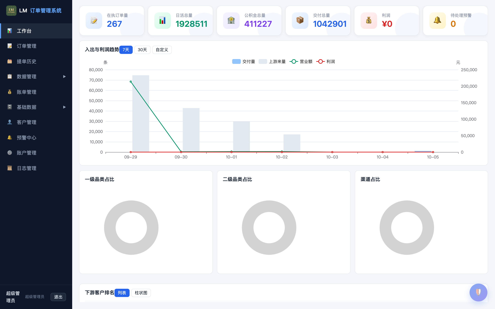

登录后的首页，展示整体经营概览。

| 区域 | 操作说明 |
|---|---|
| 顶部 6 张指标卡 | 只读展示：在执订单量、日活总量、公积金总量、交付总量、利润、待处理预警 |
| **入出与利润趋势** | 展示交付量/上游来量（柱）+ 营业额/利润（折线） |
| 「7天 / 30天 / 自定义」 | 切换趋势统计区间；选「自定义」后出现开始/结束日期与**统计**按钮 |
| 一级/二级品类占比、渠道占比 | 三个饼图，只读 |
| **下游客户排名** | 「列表 / 柱状图」切换两种展示形态 |

---

## 3. 订单管理

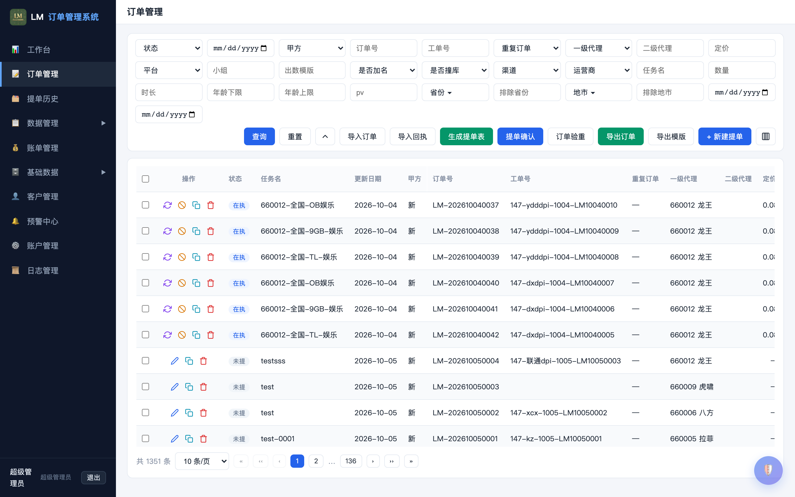

核心页面，负责订单的「新建、提单、改单、停单、复提、导入导出、验重」。

### 顶部筛选区

| 按钮 | 操作说明 |
|---|---|
| **查询** | 按上方筛选条件（状态/更新日期/甲方/订单号/工单号/代理/平台/小组/出数模版/是否加名/是否撞库等）过滤列表 |
| **重置** | 清空全部筛选条件并刷新 |
| 折叠图标 ▲/▼ | 展开/收起筛选条件行 |

### 工具栏按钮

| 按钮 | 操作说明 |
|---|---|
| **+ 新建提单** | 打开新建订单表单，填写必填项（更新日期/任务名/数量/开始日期/截止日期/上游/一级代理）后保存，状态为「未提」 |
| **导入订单** | 上传 Excel/CSV 批量导入订单；按「订单号」匹配更新，无订单号则新增 |
| **导入回执** | 上传回执文件，按「甲方+任务名」匹配订单并回填工单号 |
| **生成提单表** | 按「更新日期」筛选的未提订单，用提单模版生成提单表文件 |
| **提单确认** | 选择提单日期，将「未提/改单」订单变为「在执」，「待停」变为「已停」，并生成提单历史 |
| **订单验重** | 校验「在执」订单，运营商+URL集合+地区集合完全一致即标记为重复（写入重复订单字段） |
| **导出订单** | 按当前筛选条件导出订单（MB-019 模版格式） |
| **导出模版** | 下载订单导入/导出的 MB-019 模版文件 |
| **批量停单**（勾选后） | 选中订单批量停单，需选「更新日期+停单原因」，状态变为「待停」 |
| **批量删除**（勾选后） | 删除选中订单（不可恢复） |
| **批量复提**（勾选后，仅管理员） | 选中「已停」订单改回「未提」，需选「更新日期」 |
| **批量修改小组**（勾选后） | 批量修改选中订单的「小组」名 |
| 自定义表头图标 | 勾选要显示的列 |

### 行内操作图标

| 图标 | 说明 |
|---|---|
| ✏️ 编辑（蓝色） | 仅「未提」订单，直接编辑 |
| 改单（紫色） | 「在执/已停/改单」订单修改（渠道/运营商不可改，仅 URL/数量/地区等变化算改单） |
| 停单（橙色） | 「在执/改单」订单停单 |
| 🗑 删除（红色） | 删除该订单 |
| 双击行 | 打开订单详情弹窗 |

> 说明：甲方为「新」的订单，新建/更新/导入时若工单号为空，会按规则自动生成工单号（106→`147-kz-...`、小程序→`147-xcx-...`、dpi 按运营商与地区生成）；甲方为「牛」则保持不变。

---

## 4. 提单历史

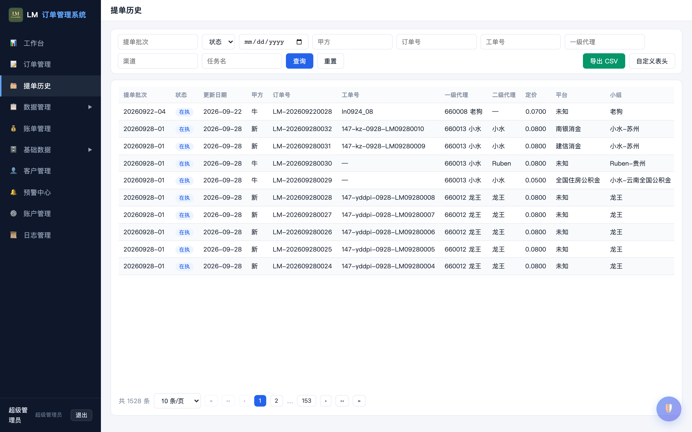

只读展示每次「提单确认」产生的历史快照。

| 按钮 | 操作说明 |
|---|---|
| **查询** | 按批次/状态/更新日期/甲方/订单号等筛选 |
| **导出 CSV** | 按筛选条件导出当前列表 |
| 自定义表头 | 选择要显示的列 |

---

## 5. 日活数据

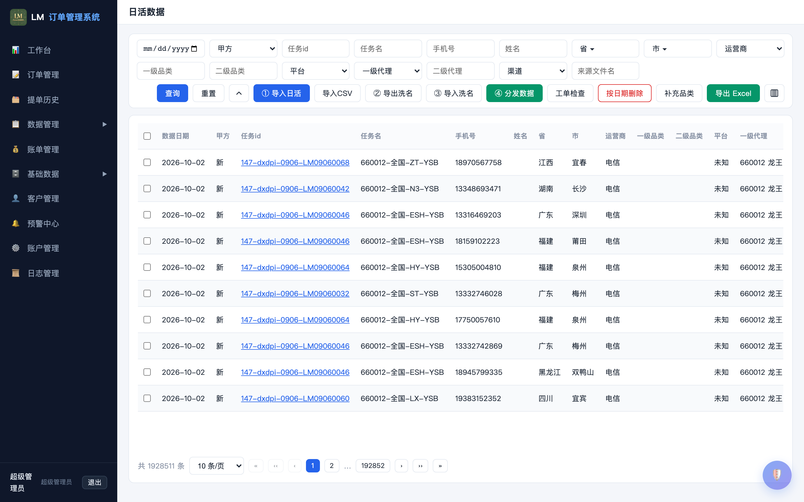

每日采集的数据明细，按「数据日期」组织，是分发/洗名/查重的数据源。

| 按钮 | 操作说明 |
|---|---|
| **查询 / 重置** | 按数据日期/甲方/任务id/任务名/手机号/省市/运营商/品类/代理等筛选 |
| **导出 Excel** | 导出当前筛选结果 |
| **① 导入日活** | 选择数据日期，上传 zip/Excel 导入（自动按「日期+任务id+手机号」去重） |
| **导入CSV**（管理员） | 上传结构化 CSV 原样导入 |
| **② 导出洗名** | 选择日期，导出「姓名为空且订单加名=是」的手机号 |
| **③ 导入洗名** | 上传洗名结果文件，按手机号回填姓名（同时同步洗名库） |
| **④ 分发数据** | 选择日期，按订单小组用出数模版生成文件打包下载，同时生成各代理账单 |
| **工单检查** | 统计所有「在执」工单在所选日期的数据量（降序），可导出 |
| **补充品类** | 按「平台→品类」映射补齐缺失的一级/二级品类 |
| **按日期删除**（管理员） | 删除所选日期下的全部日活数据 |
| **批量删除**（管理员，勾选后） | 删除勾选的行 |

---

## 6. 洗名库

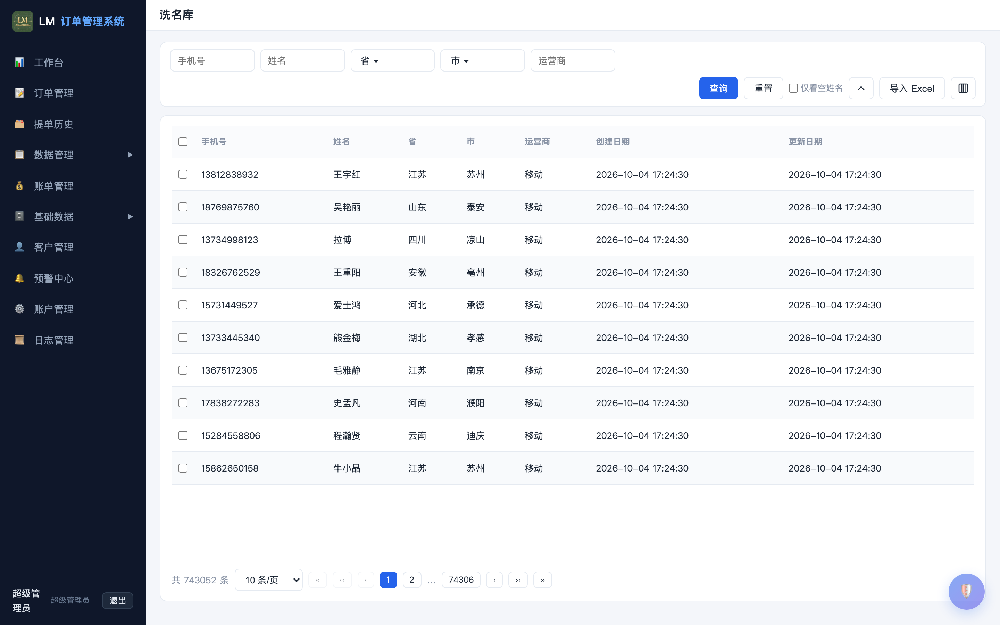

维护「手机号 → 姓名/省市/运营商」的映射库。

| 按钮 | 操作说明 |
|---|---|
| **查询 / 重置** | 按手机号/姓名/省市/运营商筛选 |
| 「仅看空姓名」勾选 | 只显示姓名为空的记录（配合查询） |
| **导入 Excel** | 上传 CSV/Excel 批量导入（按手机号去重，存在则更新） |
| **批量删除**（勾选后） | 删除勾选的洗名记录 |

---

## 7. 公积金

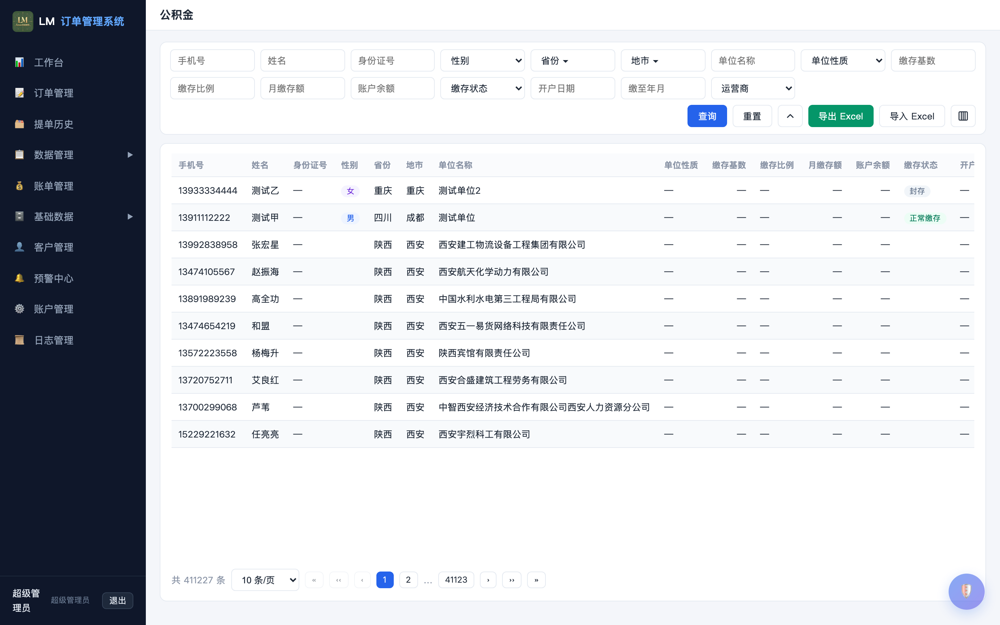

公积金名单数据。

| 按钮 | 操作说明 |
|---|---|
| **查询 / 重置** | 按手机号/姓名/省市/单位等筛选 |
| **导入 Excel** | 上传 CSV/Excel 导入 |
| **导出 Excel** | 导出当前筛选结果 |
| 行内「删除」 | 删除单条记录 |

---

## 8. 源头文件

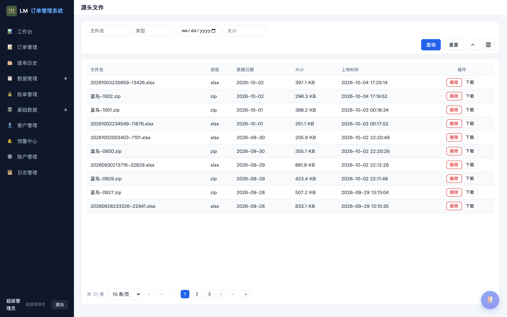

导入日活时保存的原始文件（zip/Excel）存档。

| 按钮 | 操作说明 |
|---|---|
| **查询 / 重置** | 按文件名/数据日期筛选 |
| 行内「下载」 | 下载原始文件 |
| 行内「删除」 | 删除该源文件记录 |

---

## 9. 账单管理

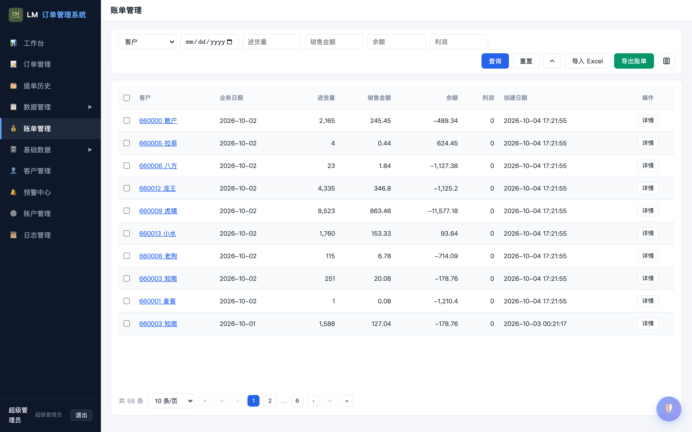

各代理按日期的账单（进货量/销售金额/余额/利润）。

| 按钮 | 操作说明 |
|---|---|
| **查询 / 重置** | 按客户/日期筛选 |
| **导入 Excel** | 上传「余额总览」sheet，按客户编号更新余额与账单 |
| **导出账单** | 按日期区间导出账单明细（含充值记录） |
| **批量删除**（管理员，勾选后） | 删除勾选账单（不动客户余额） |
| 行内「详情」 | 查看账单详情 |

---

## 10. 客户管理

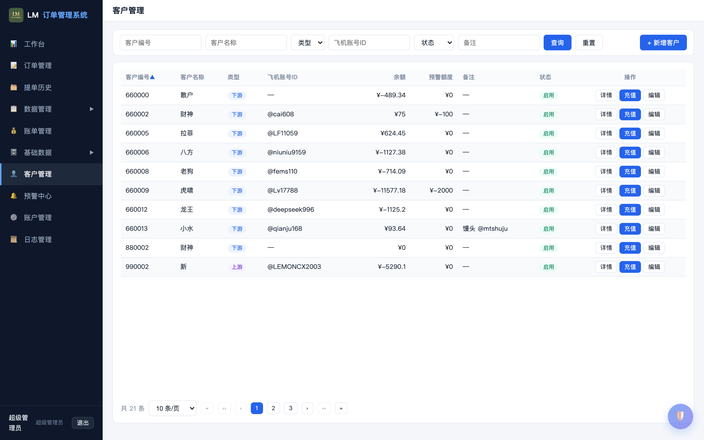

维护上下游客户、充值、渠道单价。

| 按钮 | 操作说明 |
|---|---|
| **+ 新增客户** | 打开新增表单（编号/名称/类型/飞机ID/预警额度/是否记账/起止日期/账单模版/备注） |
| 行内「详情」 | 打开客户详情（总供货/总销售/总利润/余额 + 订单/充值/单价三个标签页） |
| 行内「充值」 | 为客户账户充值（U 与人民币按汇率互换算） |
| 行内「编辑」 | 修改客户信息 |
| 详情内「+ 充值」 | 在详情中直接充值 |
| 详情内「订单记录 / 充值记录 / 设定单价」 | 切换标签查看/维护 |
| 「设定单价」页「保存单价」 | 保存该客户各渠道单价 |
| 充值弹窗「保存汇率」 | 保存 U→RMB 汇率 |

---

## 11. 配件管理

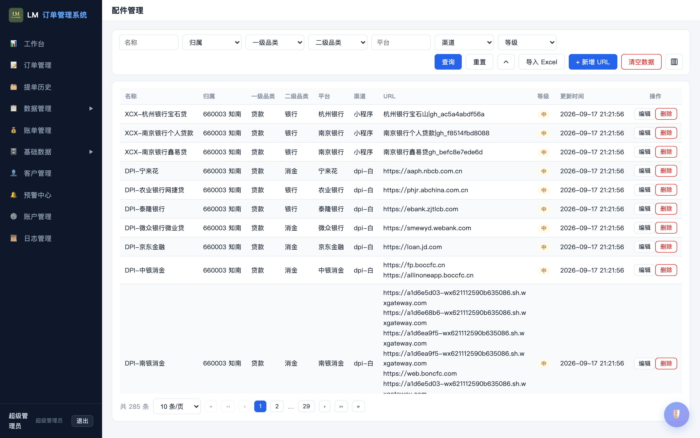

维护 URL 配件（归属/品类/平台/渠道/URL）。

| 按钮 | 操作说明 |
|---|---|
| **+ 新增 URL** | 新增配件 |
| 行内「编辑 / 删除」 | 修改或删除配件 |
| **导入 Excel** | 批量导入 |
| **清空数据** | 清空全部配件 |

---

## 12. 品类管理

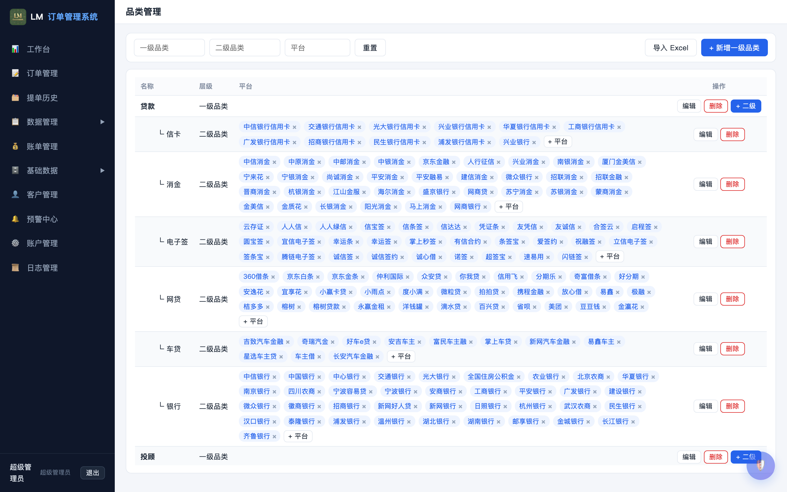

维护一级品类 / 二级品类 / 平台，三者用于「平台→品类」映射（日活补品类）。

| 按钮 | 操作说明 |
|---|---|
| 顶部三个搜索框 | 按一级品类/二级品类/平台关键字过滤 |
| **重置** | 清空搜索 |
| **导入 Excel** | 批量导入品类/平台 |
| **+ 新增一级品类** | 新增一级品类 |
| 一级品类行「编辑 / 删除 / + 二级」 | 维护一级品类并新增二级品类 |
| 二级品类行「编辑 / 删除」 | 维护二级品类 |
| 二级品类下「+ 平台」 | 为该二级品类新增平台；平台标签上的 × 可删除 |

---

## 13. 渠道管理

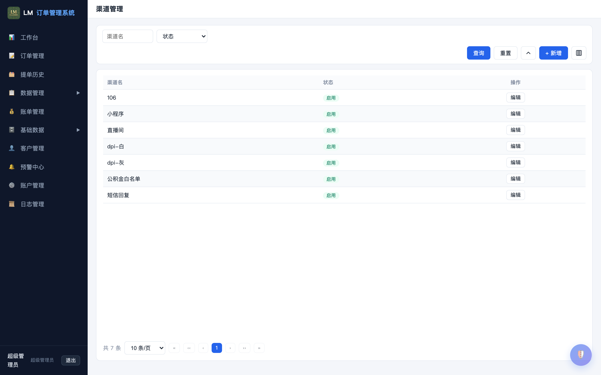

维护渠道名（106、小程序、直播间、dpi-白 等）。

| 按钮 | 操作说明 |
|---|---|
| **+ 新增** | 新增渠道 |
| 行内「编辑 / 删除」 | 维护渠道 |

---

## 14. 运营商管理

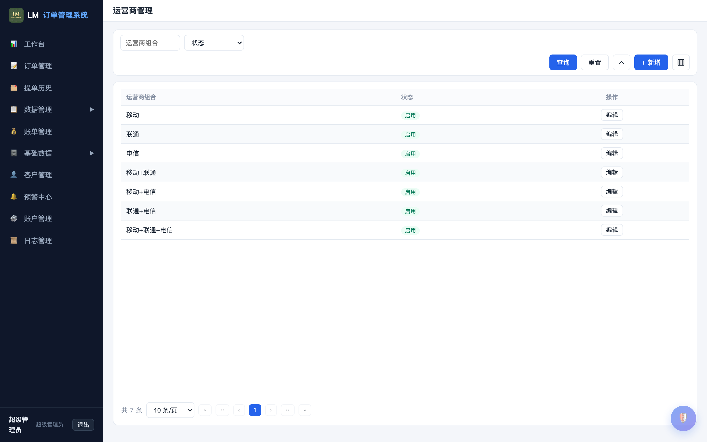

维护运营商组合（移动、联通、电信及其组合）。

| 按钮 | 操作说明 |
|---|---|
| **+ 新增** | 新增运营商 |
| 行内「编辑 / 删除」 | 维护运营商 |

---

## 15. 模版管理

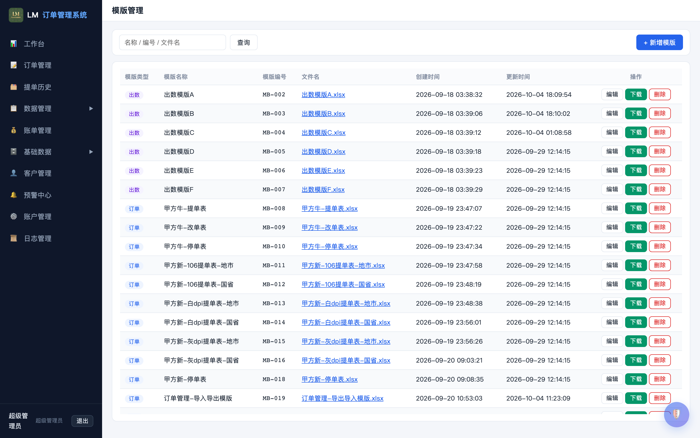

维护各类模版文件（订单/出数/账单/其他）。

| 按钮 | 操作说明 |
|---|---|
| 搜索框 + **查询** | 按名称/编号/文件名搜索 |
| **+ 新增模版** | 新增模版（类型/名称/说明，编号自动生成） |
| 行内「编辑」 | 修改模版属性（类型/名称/说明） |
| 行内「下载」 | 下载模版文件 |
| 行内「删除」 | 删除模版 |
| 编辑弹窗「上传 / 下载 / 删除文件」 | 维护模版文件 |
| 文件名链接 / 双击行 | 预览模版或查看详情 |

---

## 16. 预警中心

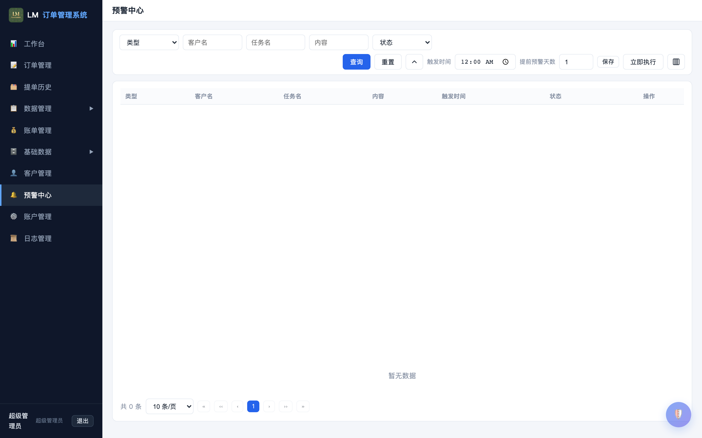

停单提醒与账单预警的处理。

| 按钮 | 操作说明 |
|---|---|
| 行内「处理」 | 标记预警为已处理 |
| 「触发时间」 | 设置每天预警扫描的触发时间 |
| 「提前预警天数」 | 设置停单提醒提前天数 |
| **保存** | 保存以上预警配置 |
| **立即执行** | 手动触发一次预警扫描 |

---

## 17. 账户管理

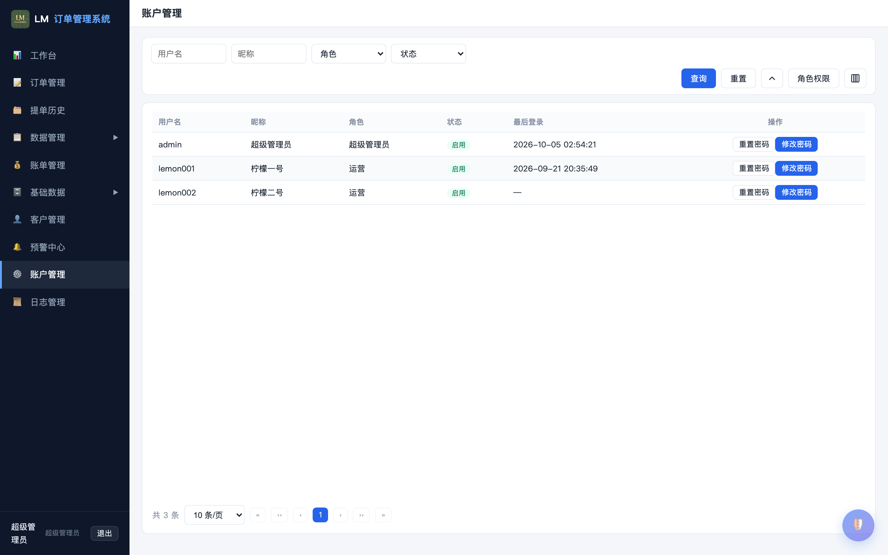

系统用户与角色权限（仅管理员可见）。

| 按钮 | 操作说明 |
|---|---|
| **+ 新增用户** | 新增系统用户 |
| 行内「重置密码 / 编辑 / 删除」 | 维护用户 |
| **角色权限** | 配置各角色可访问的菜单与操作权限 |

---

## 18. 日志管理

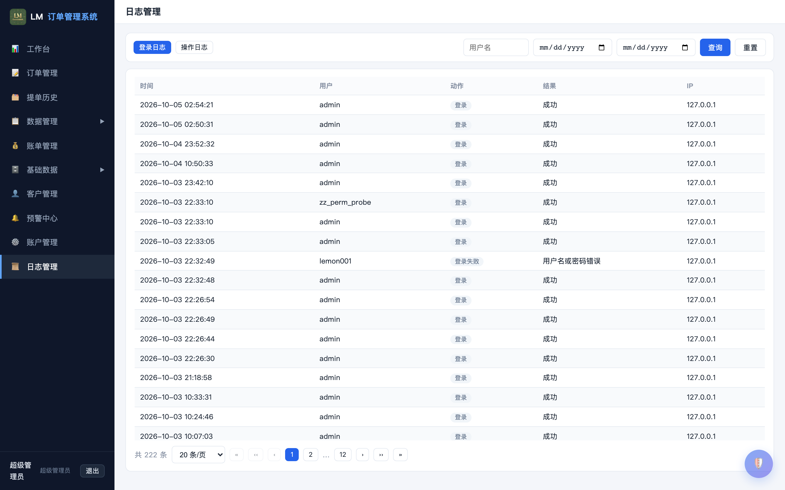

登录与操作日志（仅管理员可见）。

| 按钮 | 操作说明 |
|---|---|
| 「登录日志 / 操作日志」 | 切换日志类型 |
| 用户名/动作/起止日期 | 筛选条件 |
| **查询 / 重置** | 执行/清空筛选 |
| 操作日志「查看前后对比」 | 查看某次操作前后数据差异 |
